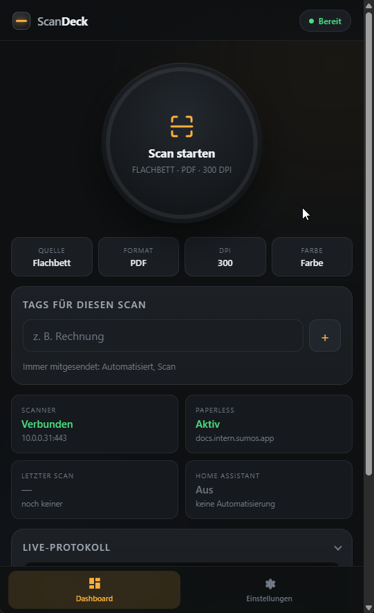
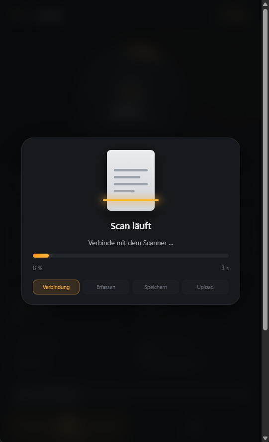

# ScanDeck

**Dokument auf den Scanner legen, Handy zücken, Knopf drücken — fertig, es liegt in Paperless-ngx.**

Kein PC hochfahren, keine Scan-Software, kein USB-Kabel, kein Umweg über den Download-Ordner. ScanDeck spricht direkt mit deinem Netzwerkscanner (HP, Brother, Canon, Epson — alles, was eSCL/AirScan kann) und schiebt das Ergebnis als PDF sofort in Paperless-ngx. Bedient wird es über eine Webseite, die auf dem Handy aussieht und sich anfühlt wie eine App — du kannst sie dir auf den Homescreen legen.

Der Ablauf, den du danach hast: Post aufmachen, Blatt auf die Glasplatte, am Handy auf *Scan starten* tippen, kurz die Vorschau sehen — und das Dokument ist getaggt in Paperless. Das sind ein paar Sekunden statt einer kleinen Bastelrunde pro Brief.

Und wenn es noch weniger sein soll: Über die Home-Assistant-Schnittstelle löst ein Taster, ein NFC-Tag oder ein Bewegungsmelder den Scan aus. Dann drückst du nicht mal mehr aufs Handy.

| Dashboard | Scanvorgang |
| --- | --- |
|  |  |

## Loslegen

Das fertige Image liegt in der GitHub Container Registry, gebaut für `amd64` und `arm64` (läuft also auch auf dem Raspberry Pi). Nichts kompilieren, einfach ziehen.

**Mit Docker Compose** — [`docker-compose.yaml`](docker-compose.yaml) herunterladen und starten:

```bash
docker compose up -d
```

**Oder mit einem einzelnen Befehl:**

```bash
docker run -d \
  --name scandeck \
  -p 8080:8080 \
  -v ./data:/data \
  -v ./scans:/scans \
  --restart unless-stopped \
  ghcr.io/dersumo/scandeck:latest
```

Dann `http://localhost:8080` im Browser öffnen (oder vom Handy aus die IP des Servers, z. B. `http://192.168.1.10:8080`).

Beim ersten Start ist **nichts vorkonfiguriert** — es begrüßt dich ein Einrichtungsassistent, der den Scanner im Netzwerk sucht, nach Paperless-ngx fragt und Format sowie Tags festlegt. Danach ist Ruhe, du siehst nur noch den Scan-Knopf.

Einstellungen landen in `./data/config.json`, die Scans in `./scans`. Beides sind Volumes und überleben ein Update.

Aktualisieren und stoppen:

```bash
docker compose pull && docker compose up -d
docker compose down
```

Wer das Image lieber selbst baut, klont das Repository und nutzt das mitgelieferte [Dockerfile](Dockerfile):

```bash
docker build -t scandeck .
```

### Dateirechte

Darum musst du dich normalerweise nicht kümmern: Der Container startet als root, setzt die Rechte der gemounteten Ordner `./data` und `./scans` einmalig zurecht und gibt die Privilegien dann ab — der Dienst selbst läuft unprivilegiert als UID 10001.

Sollen die Dateien einem bestimmten Host-Benutzer gehören, dessen IDs setzen (auf dem Host mit `id -u` und `id -g` ablesen):

```yaml
environment:
  PUID: 1000
  PGID: 1000
```

Wenn der Container per `user:` in der Compose-Datei ohne root-Rechte gestartet wird, kann er die Ordner nicht selbst korrigieren. Dann muss das einmal auf dem Host passieren:

```bash
sudo chown -R 1000:1000 ./data ./scans
```

Fehlen die Rechte, sagt ScanDeck das beim Start im Containerlog und beim Speichern als Fehlermeldung in der Oberfläche.

## Als App aufs Handy legen (PWA)

Die Oberfläche ist installierbar: In Chrome/Android über *Zum Startbildschirm hinzufügen*, in Safari/iOS über *Teilen → Zum Home-Bildschirm*. Sie läuft dann im Vollbild ohne Browserleiste, respektiert die Safe-Area und funktioniert offline so weit, dass die Oberfläche lädt (Scans brauchen natürlich das Netzwerk). Schnellaktionen im App-Icon: *Sofort scannen* und *Einstellungen*.

Damit iOS die App installieren lässt, muss die Seite über HTTPS oder `localhost` erreichbar sein — im LAN also am besten hinter einem Reverse Proxy mit Zertifikat.

## Bedienung

**Dashboard** ist auf den täglichen Ablauf reduziert: großer Scan-Button mit Fortschrittsring, vier antippbare Schnellschalter (Quelle, Format, DPI, Farbe — jeder Tipp schaltet weiter und speichert sofort), Session-Tags nur für den nächsten Scan, Statuskacheln und ein einklappbares Live-Protokoll.

Während des Scans erscheint eine Fortschrittsanzeige mit Prozentwert, Laufzeit und Phasen (Verbindung → Erfassen → Speichern → Upload). Anschließend wird der Scan **10 Sekunden lang als Vorschau** eingeblendet (Dauer unter *Einstellungen → Ausgabe* änderbar, `0` schaltet sie ab). Über *Angeheftet lassen* bleibt die Vorschau offen, *Öffnen* zeigt die Originaldatei.

### Mehrere Seiten in eine PDF

Für alles, was länger als ein Blatt ist: Auf dem Dashboard den Schalter **Stapel** umlegen. Ab dann landet jeder Scan als Seite im Stapel statt sofort in Paperless. Du scannst also Blatt für Blatt, siehst die Seiten als Vorschaubilder untereinander und drückst am Ende **Als PDF ablegen** — daraus wird ein einziges Dokument, das als Ganzes hochgeladen wird.

Was du mit einer einzelnen Seite machen kannst — das Fragezeichen neben der Überschrift erklärt es auch in der App:

- **Ziehen** — Seite antippen, kurz halten und an die richtige Stelle schieben. Falls Seite 1 und 2 vertauscht sind, muss nichts neu gescannt werden. Funktioniert auf dem Handy wie am Rechner; ein normaler Wisch scrollt weiterhin die Seite.
- **↻ Drehen** — dreht die Seite um 90° im Uhrzeigersinn, genau so wie sie später im PDF liegt. Mehrfach drücken dreht weiter.
- **⟳ Neu scannen** — markiert die Seite; der nächste Scan tauscht genau diese Seite 1:1 aus, die Reihenfolge bleibt. Nochmal drücken bricht ab.
- **× Entfernen** — wirft die Seite aus dem Stapel.

Während ein Stapel gesammelt wird, zeigt die Fortschrittsanzeige nur drei Schritte — es wird ja nichts hochgeladen. Der Upload-Schritt taucht erst beim Abschließen wieder auf.

Während eines Stapels erscheint bewusst keine Vollbild-Vorschau nach jeder Seite; das Vorschaubild in der Liste reicht und hält den Ablauf schnell. Erst das fertige Dokument wird wieder groß angezeigt. Der Stapel überlebt einen Seiten-Reload und ist auf allen Geräten gleich — du kannst also am Handy scannen und am Rechner sortieren.

Das Format des Stapels ist immer PDF, unabhängig von der Formateinstellung. Einzelne Seiten dürfen gemischt sein (PDF vom Scanner oder JPEG), sie werden beim Zusammenführen vereinheitlicht.

### Einzug und Stapel zusammen

Der automatische Einzug (ADF) und der Stapel-Modus gehen zusammen, und zwar seitenweise: Legst du fünf Blatt ein, holt ScanDeck alle fünf und legt **fünf einzelne Kacheln** in den Stapel. Jede davon lässt sich für sich verschieben, drehen, neu scannen oder wegwerfen — genau wie eine einzeln vom Glas gescannte Seite.

Das gilt auch, wenn der Scanner den ganzen Einzug als *ein* mehrseitiges PDF zurückgibt (viele Geräte tun das): ScanDeck zerlegt es in Einzelseiten, bevor sie im Stapel landen. Beim Abschließen werden sie in der von dir gewählten Reihenfolge wieder zu einem Dokument zusammengesetzt.

Ist **Neu scannen** auf einer Seite markiert und der Einzug liefert mehrere Blatt, ersetzt das erste Blatt die markierte Seite und der Rest wird direkt dahinter eingefügt — die Seiten danach behalten ihre Reihenfolge.

**Ohne** Stapel-Modus wird ein Einzugsdurchlauf zu einem einzigen Dokument zusammengefasst und als Ganzes hochgeladen, nicht zu fünf einzelnen Dateien.

Unter *Einstellungen → Ausgabe* stehen dazu **Papierformat** (A4, Letter, Legal, A5) und **Beidseitig einziehen** — letzteres erscheint nur, wenn als Quelle der Einzug gewählt ist.

ScanDeck fragt dabei ab, was dein Gerät überhaupt kann, und bietet nur das an: Ein Vorlagenglas, das bei A4 endet, zeigt Legal durchgestrichen; ein Einzug, der bei 300 dpi aufhört, sperrt 600 und 1200; ohne beidseitigen Einzug fehlt der Duplex-Schalter. Kommt eine Einstellung trotzdem einmal nicht durch — etwa aus einer älteren Konfiguration —, wird sie auf das machbare Maß gebracht und die Anpassung im Protokoll genannt, statt den Scan mit einem nackten „HTTP 409“ abzubrechen.

### Verlauf und Warteschlange

Der Reiter **Verlauf** zeigt jeden Scan mit Vorschaubild und dem, was daraus geworden ist. ScanDeck bleibt nämlich dran, bis Paperless-ngx bestätigt hat:

- **Wartet auf Upload** — Paperless war nicht erreichbar. ScanDeck versucht es von selbst erneut, mit wachsendem Abstand (30 s, 2 min, 5 min, 15 min, dann stündlich). Nichts geht verloren, auch wenn dein Server gerade neu startet.
- **Wird verarbeitet** — die Datei ist drüben, Paperless arbeitet noch.
- **In Paperless** — bestätigt, mit Dokumentnummer.
- **Duplikat** — Paperless kennt das Dokument schon und hat es abgelehnt. Früher hättest du das nie erfahren.
- **Fehlgeschlagen** — mit Begründung von Paperless.

Pro Eintrag kannst du erneut senden, die Datei öffnen oder Eintrag und Datei löschen.

### Aufräumen

Unter *Einstellungen → Aufräumen* lässt sich einschalten, dass lokale Kopien nach einer Wartezeit (Standard 24 Stunden) gelöscht werden. Damit läuft der Ordner nicht voll, obwohl er auf einem Volume liegt.

Gelöscht wird ausschließlich, was Paperless **bestätigt** hat. Alles, was noch in der Warteschlange hängt, abgelehnt wurde oder als Duplikat gilt, bleibt liegen — die Wartezeit kann eine offene Datei also nie wegräumen. Der Eintrag im Verlauf bleibt erhalten und zeigt an, dass die lokale Kopie aufgeräumt wurde.

### Extras

Damit das Dashboard schlank bleibt, sind Zusatzfunktionen unter *Einstellungen → Extras* einzeln zuschaltbar:

- **Korrespondent und Dokumenttyp beim Scannen wählen** — ScanDeck lädt beide Listen aus deiner Paperless-Instanz. Die Auswahl gilt für den nächsten Scan und wird nicht dauerhaft gespeichert, spart aber das spätere Nachsortieren.
- **Schnell-Tags** — die meistgenutzten Tags aus Paperless als antippbare Vorschläge über dem Eingabefeld. Eigene Tags lassen sich weiterhin frei eintippen.
- **Scanner beim Öffnen aufwecken** — siehe Geschwindigkeit.

**Einstellungen** verwaltet Scanner, Paperless-ngx, Ausgabe, Standard-Tags, Home Assistant und das Zurücksetzen der Konfiguration.

- Unter **Scanner** genügt ein Klick auf *Netzwerk automatisch durchsuchen*. ScanDeck rät das Netz nicht, sondern leitet es aus der Adresse des Geräts ab, mit dem du gerade die Oberfläche geöffnet hast — das steht im selben Netz wie der Scanner. Zusätzlich werden die Netze deiner Paperless-Adresse und die üblichen Router-Standards (`192.168.0.x`, `192.168.1.x`, `192.168.178.x`, `10.0.0.x`) geprüft, bis etwas gefunden wird. Docker-eigene Netze werden dabei ans Ende gestellt, weil dort nie ein Scanner steht. Manuell geht weiterhin über *Netzwerk manuell angeben*. Die Suche prüft ausschließlich `ScannerCapabilities` und löst keinen Scan aus.
- Der Paperless-Token wird nur in `./data/config.json` gespeichert und nie wieder an den Browser ausgegeben.
- Standardformat ist **PDF**.
- *Konfiguration löschen* setzt alles zurück und startet den Assistenten erneut.

## Home Assistant

Unter *Einstellungen → Home Assistant* die Schnittstelle aktivieren; dabei wird lokal ein API-Key erzeugt. Die passende YAML-Konfiguration steht dort zum Kopieren bereit.

| Endpoint | Methode | Zweck |
| --- | --- | --- |
| `/api/ha/scan` | POST | Scan auslösen. Optionaler JSON-Body: `tags`, `source`, `resolution`, `color_mode`, `output_format`, `upload_to_paperless`, `title_prefix`. |
| `/api/ha/state` | GET | Status für einen RESTful-Sensor: `state` (`idle`/`scanning`/`error`), `progress`, `stage`, `last_file`, `last_error`. |
| `/api/ha/batch` | POST | Stapel steuern: `{"action": "start"}`, `"finish"` oder `"cancel"`. Bei laufendem Stapel wird jeder ausgelöste Scan zu einer weiteren Seite. |
| `/api/ha/test` | POST | Verbindungstest. |

Authentifizierung über den Header `X-API-Key` (alternativ `Authorization: Bearer …` oder `?api_key=`). Ohne aktivierte Schnittstelle antworten die Endpunkte mit `403`.

```yaml
rest_command:
  scan_deck_scan:
    url: "http://scan-deck.local:8080/api/ha/scan"
    method: POST
    headers:
      X-API-Key: !secret scan_deck_key
      Content-Type: "application/json"
    payload: '{"tags": ["Automatisiert"]}'

automation:
  - alias: "Scan bei Bewegung am Schreibtisch"
    trigger:
      - platform: state
        entity_id: binary_sensor.schreibtisch_bewegung
        to: "on"
    action:
      - service: rest_command.scan_deck_scan
```

Damit lässt sich auch ein Stapel ohne Handy bedienen: ein Taster startet den Stapel, jeder weitere Druck scannt eine Seite, langes Drücken schließt ab.

Als Auslöser eignet sich alles, was Home Assistant kennt: Bewegungsmelder, Zigbee-Taster, NFC-Tag, Sprachbefehl oder ein Zeitplan. Zusätzlich lässt sich unter *Webhook zurück an Home Assistant* eine URL hinterlegen — dorthin meldet Scan Deck nach jedem Scan `status`, `file`, `error` und `trigger`, sodass HA auf das Ergebnis reagieren kann.

## Paperless-ngx-Upload

### Geschwindigkeit

Ein Scan besteht aus drei Anfragen an den Scanner: Status abfragen, Auftrag anlegen, Dokument abholen. ScanDeck hält die HTTPS-Verbindung dazwischen offen, statt sie dreimal neu aufzubauen — der TLS-Handshake fällt damit nur einmal an, und Drucker-Firmware ist beim Verschlüsseln meist ziemlich langsam. Wie lange ein Scan gebraucht hat, steht im Live-Protokoll hinter dem Dateinamen.

ScanDeck merkt sich außerdem, wie lange dein Gerät für jede Kombination aus Quelle, Auflösung, Farbmodus und Format braucht, und speichert das in `./data/timings.json`. Ab dem zweiten Scan eines Profils läuft der Fortschrittsbalken deshalb in echter Zeit statt geschätzt, und die Anzeige nennt die verbleibenden Sekunden. Gemessen wird gleitend, langsame Ausreißer verziehen den Wert also nicht dauerhaft; dauert ein Scan länger als erwartet, kriecht der Balken weiter, statt stehen zu bleiben. Die Datei kann jederzeit gelöscht werden, dann lernt ScanDeck neu.

Der Rest der Wartezeit ist der Scanner selbst: Lampe aufwärmen, Schlitten fahren, Bild übertragen. Gegen den Schlafmodus hilft die Option *Scanner beim Öffnen der App aufwecken*: ScanDeck fragt dann im Hintergrund einmal den Gerätestatus ab, sobald du die App öffnest oder zu ihr zurückkehrst. Während du noch Tags tippst, ist das Gerät schon wach.

Zwei weitere Stellschrauben helfen spürbar:

- **Auflösung** — 600 dpi dauert grob viermal so lange wie 300 dpi und bringt bei normalem Papier nichts. Für Briefe reichen 200–300 dpi.
- **Farbmodus** — Graustufen überträgt ein Drittel der Daten von Farbe.

Manche Geräte bieten eSCL zusätzlich unverschlüsselt auf Port 80 an (`http://scanner-ip:80` statt `https://scanner-ip:443`). Das spart den Handshake ganz. Im eigenen LAN ist das vertretbar; über Netzgrenzen hinweg bleib bei HTTPS.

### Durchsuchbare PDFs (OCR)

ScanDeck macht **kein** OCR. Der Scanner liefert ein reines Bild-PDF, und genau das wird abgelegt und hochgeladen. Die Texterkennung übernimmt Paperless-ngx beim Import mit OCRmyPDF/Tesseract — dort entsteht das durchsuchbare Dokument. Die Datei in `./scans` bleibt dagegen immer ein Bild-PDF.

Wichtig ist dabei die Sprache: Paperless-ngx erkennt standardmäßig **Englisch**. Für deutsche Dokumente gehört in dessen Compose-Datei:

```yaml
environment:
  PAPERLESS_OCR_LANGUAGE: deu
  PAPERLESS_OCR_LANGUAGES: deu eng
```

`PAPERLESS_OCR_LANGUAGE` ist die Sprache, mit der erkannt wird; `PAPERLESS_OCR_LANGUAGES` bestimmt, welche Sprachpakete überhaupt installiert werden. Ohne das zweite fehlt Tesseract das deutsche Modell. Ab Paperless-ngx 2.x lässt sich die Sprache alternativ in dessen Oberfläche unter *Einstellungen → Konfiguration* setzen; ist sie dort leer, gilt die Umgebungsvariable.

Kontrollieren lässt sich das an einem importierten Dokument: Enthält der Textinhalt in Paperless deutsche Umlaute statt Zeichensalat, passt die Sprache.

### Upload

Der Upload verwendet `POST /api/documents/post_document/` mit Token-Authentifizierung. Standard-Tags werden über ihre Namen in Paperless-IDs aufgelöst; optional legt die App fehlende Tags selbst an. Paperless verarbeitet das Dokument anschließend asynchron. Siehe die [Paperless-ngx API-Dokumentation](https://docs.paperless-ngx.com/api/).

## Versionierung

ScanDeck folgt [Semantic Versioning](https://semver.org/lang/de/). Die maßgebliche Versionsnummer steht in der Datei `VERSION`; von dort liest sie die Anwendung ein und zeigt sie dezent neben dem Logo an. Alle Änderungen stehen im [CHANGELOG](CHANGELOG.md).

Die App sieht einmal beim Start und danach alle sechs Stunden bei GitHub nach, ob es ein neueres Release gibt. Falls ja, färbt sich die Versionsanzeige neben dem Logo amber und bekommt einen kleinen Pfeil — ein Tipp darauf öffnet die Release-Seite. Unter *Einstellungen → Version* lässt sich sofort prüfen oder die Abfrage ganz abschalten; sie geht ausschließlich an `api.github.com` und sendet nichts über deine Installation.

Für eine neue Version: `VERSION` anheben, den Changelog ergänzen, committen und taggen. Der Workflow [`docker-publish.yml`](.github/workflows/docker-publish.yml) führt die Tests aus, baut daraufhin das Image für amd64 und arm64 und veröffentlicht es unter der neuen Versionsnummer — er bricht ab, wenn die Tests fehlschlagen oder Tag und `VERSION` nicht zusammenpassen.

```powershell
git tag -a v1.0.1 -m "ScanDeck 1.0.1"
git push origin main --tags
```

## Mitentwickeln

Der Code liegt in zwei Ebenen: [`app.py`](app.py) hält die HTTP-Oberfläche, den Laufzeitzustand und die Hintergrundschleife; alles, was für sich allein Sinn ergibt, steht im Paket [`scandeck/`](scandeck/).

| Modul | Zuständig für |
| --- | --- |
| [`config.py`](scandeck/config.py) | Was gespeichert werden darf, Prüfung, `config.json` |
| [`escl.py`](scandeck/escl.py) | Gespräch mit dem Scanner: Fähigkeiten, Status, Scanauftrag |
| [`network.py`](scandeck/network.py) | Welche Netze und Ports nach einem Scanner abgesucht werden |
| [`documents.py`](scandeck/documents.py) | Vorschau, Seiten trennen, Seiten zusammenführen |
| [`batch.py`](scandeck/batch.py) | Der gesammelte Stapel und seine Reihenfolge |
| [`jobs.py`](scandeck/jobs.py) | Upload-Warteschlange und gemessene Scandauern |
| [`paperless.py`](scandeck/paperless.py) | Upload und Rückmeldung von Paperless-ngx |
| [`events.py`](scandeck/events.py) | Live-Protokoll und Fortschritt für alle Oberflächen |
| [`updates.py`](scandeck/updates.py) | Versionsabgleich mit GitHub |

Tests laufen ohne Gerät und ohne Netz — der Scanner wird nachgebildet:

```bash
pip install -r requirements-dev.txt
pytest -q
```

## Lizenz

[MIT](LICENSE)

## Zugriffsschutz

Standardmäßig ist die Oberfläche offen — ScanDeck ist für das eigene Netz gedacht, und ein Passwort vor dem Scan-Knopf stört dort öfter, als es nützt.

Unter *Einstellungen → Zugriffsschutz* lässt sich ein Passwort vergeben (mindestens 8 Zeichen). Danach verlangt **die gesamte Oberfläche und jeder API-Endpunkt** eine Anmeldung. Sinnvoll, wenn Gäste im WLAN sind, mehrere Haushalte am selben Netz hängen oder ScanDeck hinter einem Reverse Proxy steht.

Was dabei bewusst offen bleibt:

- `/health` — der Container prüft sich damit selbst; mit Passwort würde er sich als ungesund melden.
- Die Startseite samt Stylesheet und Skript, sonst ließe sich die Anmeldemaske nicht anzeigen.
- Die Endpunkte `/api/ha/scan`, `/api/ha/state`, `/api/ha/batch` und `/api/ha/test` — sie weisen sich mit dem **Home-Assistant-API-Key** aus. Bestehende Automatisierungen laufen also weiter, ohne dass du etwas anpasst. Der Key selbst (`/api/ha/key`) ist mit eingeschaltetem Schutz nur noch angemeldet lesbar.

Weiteres zum Verhalten:

- Das Gerät, das den Schutz einschaltet, bleibt angemeldet — man sperrt sich nicht selbst aus.
- Das Passwort liegt nur als Hash in `config.json`, niemals im Klartext, und wird nie über die API herausgegeben.
- Ein **Passwortwechsel meldet alle anderen Geräte ab**; genau dafür wechselt man es.
- Zehn Fehlversuche hintereinander sperren die Anmeldung für fünf Minuten.
- Die Sitzung gilt 30 Tage und übersteht einen Neustart des Containers.

Kein Passwort mehr? Dann in `data/config.json` `"auth_enabled": false` setzen und den Container neu starten.

## Sicherheitsnotiz

Ohne eingeschalteten Zugriffsschutz hat die Anwendung keine Benutzeranmeldung — der Home-Assistant-API-Key schützt dann nur die `/api/ha/*`-Endpunkte, nicht die Oberfläche. Stelle den Port `8080` in keinem Fall ungeschützt ins Internet; der Zugriffsschutz ist als Schranke im eigenen Netz gedacht, nicht als Härtung gegen das offene Netz. Paperless-Token und API-Key liegen im persistenten Volume im Klartext; schütze daher den Ordner `data` und sichere ihn nicht unbedacht in öffentliche Repositories.
